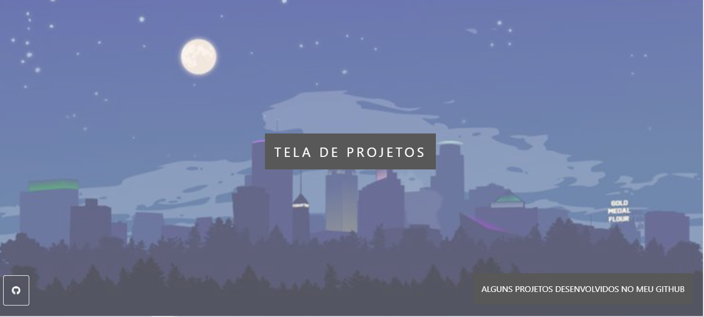
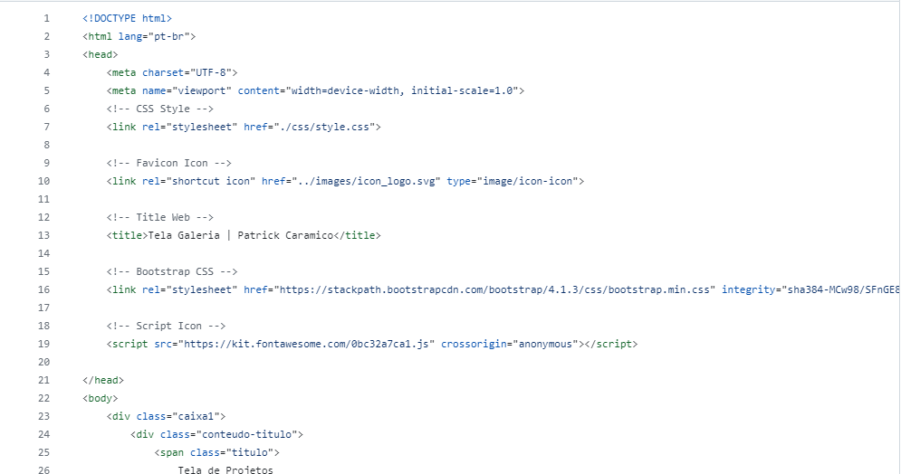
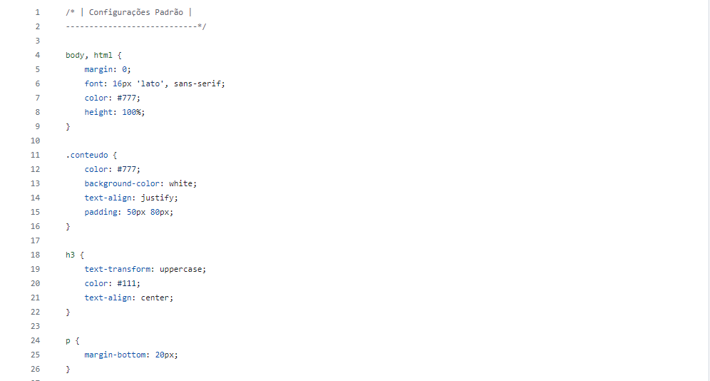

# Gallery_screen

Modelo de galeria em formado de Parallax

# Readme Contents:

- [Summary](#summary)
  - [About the project](#about)
  - [screenshot](#screenshot)
- [My code](#codes)
  - [HTML](#html)
  - [CSS](#css)
- [Autor](#autor)
  - [link](#link)
 
## summary

### about

Esse projeto foi desenvolvido como uma ideia de tela de galeria, possui alguns projetos em catalogo com efeito de Parallax, utilizando HTML, CSS e o Bootstrap4

 

### screenshot

## codes

### html

Code HTML

 

### css

Code CSS

 

## autor

### link

**link to acess the project**
https://patrickcaramico.github.io/Gallery_screen/
